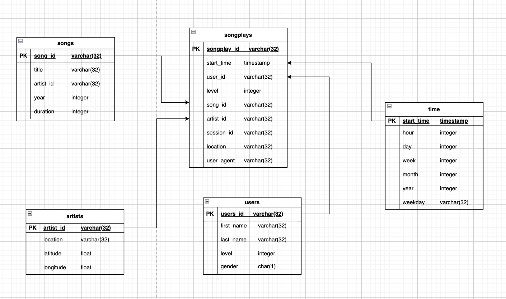

# Project: Data Warehouse

### Introduction
A music streaming startup, Sparkify, has grown their user base and song database and want to move their processes and data onto the cloud. Their data resides in S3, in a directory of JSON logs on user activity on the app, as well as a directory with JSON metadata on the songs in their app.

As their data engineer, you are tasked with building an ETL pipeline that extracts their data from S3, stages them in Redshift, and transforms data into a set of dimensional tables for their analytics team to continue finding insights into what songs their users are listening to.

#### Sparkfy Star Schema Database

The purpose of this database is to make data efficiently queriable for analysis on the songplay history of users. As their data is already stored in S3, it is straight forward to create staging tables with the original schema of the data in the Redshift cluster. The data from the staging tables is then transformed into the final Star Schema Database as seen below. The star schema is chosen as it aims to optimize queries on large amount of data. The fact table songplays contains foreign keys of all dimension tables and therefore it is easy to perform slice and dice analysis. For Sparkify this schema is appropriate as it is easily understandable. 

The ETL steps include the creation of the staging tables, the creation of the star schema tables. The distkey style, distkey and sortkey are chosen as follows

 Table | Distkeystyle | Distkey | Sortkey | Reasoning Sortkey | Reasoning Distkey |
| --- | --- | --- | --- | --- | --- |
| songplay | Key | start_time | start_time | Join to the time table; recent histories of songplays could be more interesting to analyze, also range of timeframes | Data distributed across Redshift cluster nodes by start_time already has subset of time ranges in the nodes and can speed up query performances when ranges of timeframes or specific time stamps are analyzed |
| songs | N/A | N/A | song_id | Join to songplay table | N/A |
| users | N/A | N/A | user_id | Join to songplay table | N/A |
| artists | N/A | N/A | artist_id | Join to songplay table | N/A |
| time | N/A | N/A | start_time | Join to songplay table | N/A |

After the tables are defined the raw data is copied from S3 to the Redshift cluster into the staging tables. The song data follows the default json format while the log data follows the given log_json_path.json format. 
Finally the data is inserted into the star schema and it is regarded that the data only includes records in event data associated with song plays i.e. records with page equal to NextSong.

