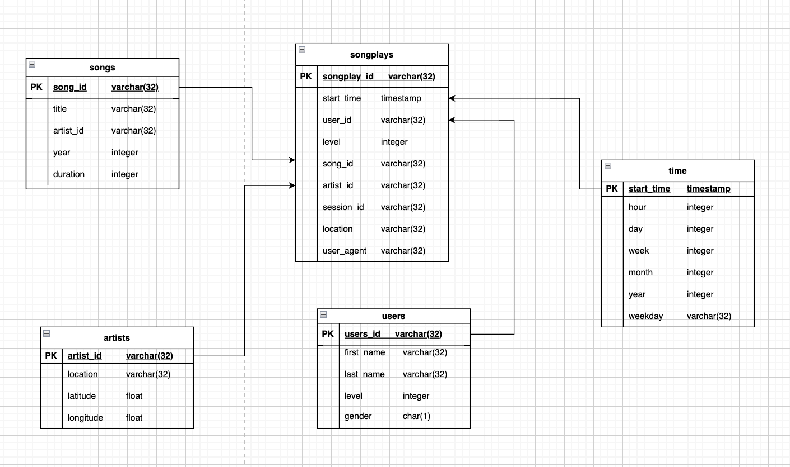

# Project: Data Warehouse

### Introduction
A music streaming startup, Sparkify, has grown their user base and song database and want to move their processes and data onto the cloud. Their data resides in S3, in a directory of JSON logs on user activity on the app, as well as a directory with JSON metadata on the songs in their app.

As their data engineer, you are tasked with building an ETL pipeline that extracts their data from S3, stages them in Redshift, and transforms data into a set of dimensional tables for their analytics team to continue finding insights into what songs their users are listening to.

#### Sparkfy Star Schema Database

The purpose of this database is to make data efficiently queriable for analysis on the songplay history of users. As their data is already stored in S3, it is straight forward to create staging tables with the original schema of the data in the Redshift cluster. The data from the staging tables is then transformed into the final Star Schema Database as seen below. The star schema is chosen as it aims to optimize queries on large amount of data. The fact table songplays contains foreign keys of all dimension tables and therefore it is easy to perform slice and dice analysis. For Sparkify this schema is appropriate as it is easily understandable

